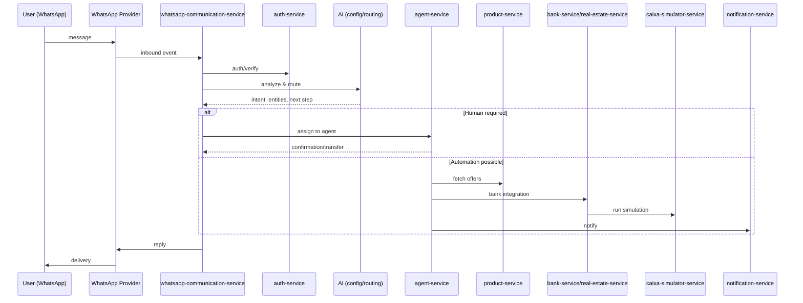
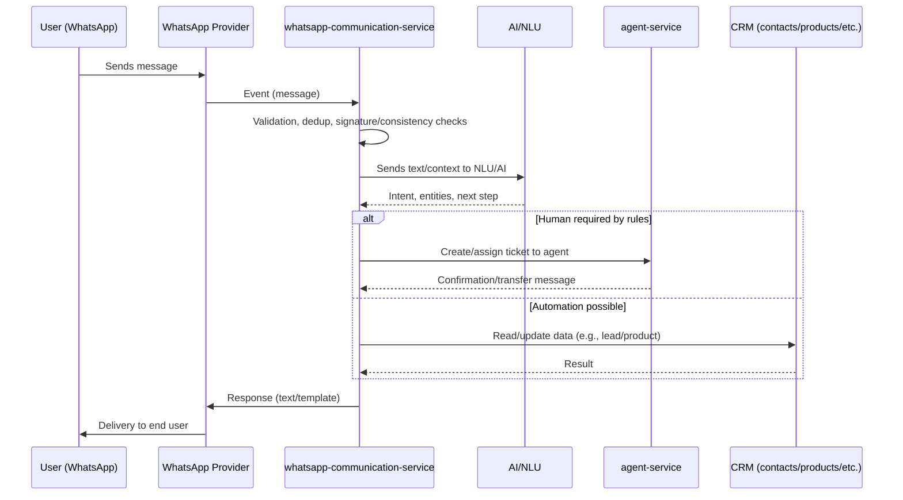
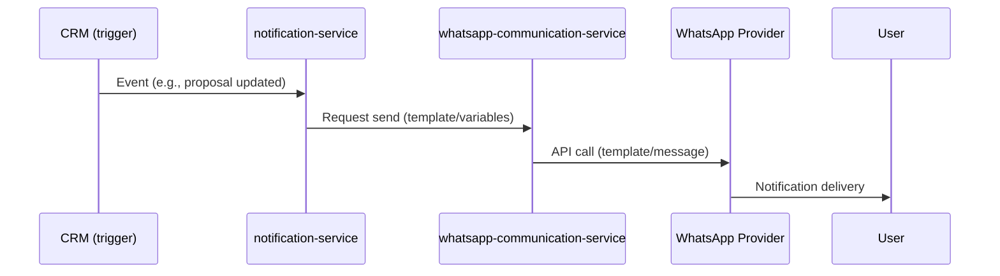

# SmartIA Systems CRM — Overview and Integrations (WhatsApp + AI)

This monorepo brings together CRM services, WhatsApp communication, and AI features that enable lead capture, conversational support, qualification, proposal orchestration, and sales follow‑up.

Below is an overview of the architecture, service roles, key flows, and operational best practices.

## High‑Level Architecture

Main components:

- Frontend (portal/operator/customer): CRM UI and back‑office.
- Backend (microservices): authentication, agents, master data, products, banking integrations, notifications, and communications.
- External integrations: WhatsApp provider (Baileys/Cloud API/others), email/SMS, banks, and simulators.
- AI layer: NLU/NLP, dialog orchestration, validations, memory, and business automations.

Notes:
- Inbound WhatsApp events are routed through the communication service to auth, AI, and domain services.
- Responses are sent back to the provider and delivered to the end user.

## Service Roles (overview)

Descriptions are generic and may vary per implementation in each folder.

- [auth-service](auth-service/): authentication, token issuance/validation, roles/permissions.
- [agent-service](agent-service/): operators/agents, queues, assignment, history.
- [product-service](product-service/): catalog/offers, eligibility rules, pricing.
- [bank-service](bank-service/): generic banking integrations (proposals, status).
- [real-estate-service](real-estate-service/): real‑estate data, associated simulations.
- [caixa-simulator-service](caixa-simulator-service/): Caixa‑specific simulations (e.g., housing).
- [contact-service](contact-service/): contacts/leads, profiles, preferences.
- [contract-service](contract-service/): contract generation/management and signatures.
- [notification-service](notification-service/): email/SMS/push and scheduled communications.
- [whatsapp-communication-service](whatsapp-communication-service/): inbound events, templates, send/receive via provider.
- [ia-admin-configuration-service](ia-admin-configuration-service/): AI policies/config, prompts, guardrails.
- [ia-customer-configuration-service](ia-customer-configuration-service/): customer profiles/context, conversation rules.
- [infra-service](infra-service/): infrastructure utilities (health, storage, etc.).
- [frontend](frontend/): CRM UIs.

There are supporting modules and backups in [_backups](_backups/) (excluded from VCS by default) and tools in [tools](tools/) (also excluded).

## Key Flows

### 1) Inbound Message (WhatsApp)

### 2) Outbound Message (Notification)

## WhatsApp Integration (Baileys)

- Provider: Baileys (WhatsApp Web/Multi‑device) via `@whiskeysockets/baileys` in [whatsapp-communication-service](whatsapp-communication-service/).
- Connection: persistent WebSocket; messages arrive via library events (not HTTP webhooks).
- Pairing: scan QR in terminal on first auth (or link device). In production, persist auth state in a volume.
- Key events: `connection.update`, `messages.upsert`, `contacts.update`, `chats.update`.
- Sending: `sendMessage(jid, content, options)` with text, media, buttons, and lists (when supported). No HSM; templates handled by the app.
- Policies: follow WhatsApp usage policies. As this is WhatsApp Web, HSM windows do not apply, but best practices and limits still do.
- Idempotency: use `message.key.id`/`messageID` for deduplication.

Recommended variables (adapt to service code):

- `WHATSAPP_PROVIDER=baileys`
- `BAILEYS_STORE_PATH=./.baileys` (auth/state directory)
- `BAILEYS_QR_TERM=true` (show QR in terminal)
- `BAILEYS_LINK_DEVICE=false` (use device link flow when applicable)
- `WHATSAPP_DEFAULT_SENDER_JID=` (e.g., `5511999999999@s.whatsapp.net`)

Best practices:
- Do not version the session folder (`.baileys/`) or QR artifacts (PNG/SVG).
- Use encrypted persistent storage for credentials/session in production.
- Implement reconnection with backoff and handle `loggedOut`/`badSession` states.

## AI Integration (ChatGPT/OpenAI)

- NLU/NLP: intent detection, entity extraction (e.g., income, city, property).
- Orchestration: decides between automation, data collection, or human handoff.
- Memory: conversation context (short‑term) plus CRM history (long‑term) when authorized.
- Guardrails: scope limits, policy validation, and sensitive‑content blocking.
- Fallback: confirmations, clarification requests, and human escalation when needed.

Common variables:

- `AI_PROVIDER=openai`
- `AI_MODEL` (e.g., `gpt-4o-mini`, `gpt-4.1`)
- `OPENAI_API_KEY`
- `OPENAI_BASE_URL` (optional for proxy/self‑host)

Suggestions:
- Standardize system messages/policies in [ia-admin-configuration-service](ia-admin-configuration-service/).
- Use function/tool calling for integrations (e.g., contact/product lookups) when implemented in the orchestrator.

## Security & Privacy (LGPD/GDPR)

- Data minimization: collect only what is necessary for the declared purpose.
- Consent & transparency: inform data use and purposes (support, proposals, notifications).
- Data subject rights: support access, rectification, and deletion requests.
- Retention: define retention periods and purge policies.
- Logging/observability: avoid sensitive data in logs; anonymize/mask when needed.
- Secrets: `.env` and keys must not be committed (see [.gitignore](.gitignore)). Consider a secret manager.

## Environment Configuration

Each service has its own variables and `README`/examples. In general:

1. Copy the example file: `cp .env.example .env` (where available).
2. Fill keys (`*_API_KEY`, provider tokens/IDs, external URLs).
3. Configure databases/queues per service (`DATABASE_URL`, `REDIS_URL`, etc.).
4. Set `BASE_URL`/`PUBLIC_URL` for WhatsApp callbacks when applicable.

## Local Run (general guidance)

Stacks vary per service; check each service README. In general:

- Node.js/TS
  - `npm ci`
  - `cp .env.example .env`
  - `npm run dev` or `npm start`

- Java (Spring)
  - `./mvnw spring-boot:run` or `./gradlew bootRun`

- Docker Compose (when provided)
  - `docker compose up -d`

Tip: start `auth-service` and `whatsapp-communication-service` first, then domain services (contacts/products), and finally external integrations (banks/simulators).

## Logging, Metrics, and Observability

- Correlation: propagate `correlationId`/`requestId` across services.
- Levels: `info` for normal flow, `warn` for recoverable issues, `error` for failures.
- Metrics: WhatsApp delivery rates, NLU latency, human handoff rate, conversions.
- Alerts: webhook availability, provider error rates, AI/bank response times.

## Resilience & Operations

- Retries with exponential backoff and idempotency by business key.
- Circuit breakers for external services (provider, banks, AI).
- Dead‑letter queues (if messaging exists) for investigation.
- Automatic human escalation on critical AI failures.

## Roadmap (example)

- Unify prompts and policies in [ia-admin-configuration-service](ia-admin-configuration-service/).
- WhatsApp template catalog versioned and validated in CI.
- Recovery playbooks (DR) and chaos testing.
- End‑to‑end conversation and conversion analytics dashboard.

---

Questions or suggestions? Open an issue or check the service‑specific READMEs.
