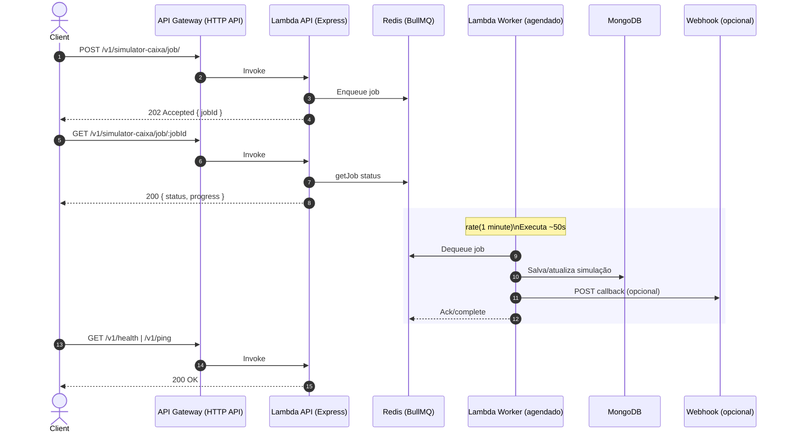

# Caixa Simulator Service

API e Worker para simulações de financiamento com Puppeteer, usando fila BullMQ em Redis e persistência em MongoDB. A arquitetura foi otimizada para o Free Tier da AWS (Lambda + HTTP API), evitando custos de ECS/ALB 24x7.

## Visão Geral
- API (Lambda + HTTP API): expõe endpoints REST via Express (serverless-http).
- Fila (Redis Cloud + BullMQ): a API enfileira jobs de simulação.
- Worker (Lambda agendado): consome jobs periodicamente e executa as simulações com Puppeteer.
- MongoDB: armazena resultados/estado das simulações.
- SSM Parameter Store: gerencia segredos/URLs (Mongo, Auth/JWT, Redis, etc.).
- CloudWatch Logs: observabilidade de API e worker.

Fluxo resumido:
1) Client → API Gateway (HTTP API) → Lambda `api` (Express) → Enfileira no Redis.
2) Lambda `worker` (agendado) → Busca jobs da fila → Executa simulação (Puppeteer) → Atualiza Mongo → Opcionalmente dispara webhooks.

## Diagrama de Fluxo de Chamadas



## Diagrama de Arquitetura (Alto Nível)

```mermaid
flowchart LR
    Client((Client)) --> APIGW[API Gateway (HTTP API)]
    APIGW --> LambdaAPI[Lambda API (Express)]
    LambdaAPI --> Redis[(Redis Cloud - BullMQ)]
    LambdaAPI -.-> SSM[(SSM Parameter Store)]
    LambdaAPI -.logs.-> CW[(CloudWatch Logs)]

    EB[EventBridge Rule\n(rate 1 min)] --> Worker[Lambda Worker]
    Worker --> Redis
    Worker --> Mongo[(MongoDB)]
    Worker -.logs.-> CW
    Worker -.-> SSM

    subgraph AWS
      APIGW
      LambdaAPI
      Worker
      EB
      SSM
      CW
    end

    classDef svc fill:#f0f9ff,stroke:#60a5fa,color:#111;
    classDef data fill:#f1f5f9,stroke:#94a3b8,color:#111;
    class APIGW,LambdaAPI,Worker,EB,SSM,CW svc;
    class Redis,Mongo data;
```

## Endpoints
Base: `https://<api-id>.execute-api.<region>.amazonaws.com`

- `GET /v1/health` (sem autenticação)
- `GET /v1/ping` (sem autenticação)
- `POST /v1/simulator-caixa/job/` (requer `Authorization: Bearer <JWT>`)
  - Body mínimo: `{ "whatsappSimulationId": "<ObjectId>", ... }`
- `GET /v1/simulator-caixa/job/:jobId` (requer `Authorization`)
- `GET /v1/simulator-caixa/simulation/:id` (requer `Authorization`)

Observações:
- A camada HTTP API tem timeout de 30s; cargas longas devem ir via fila + worker.
- O middleware `authorizeAccessUser` valida o JWT com o segredo em SSM.

## Arquitetura (atual)
- Lambda API: `lambda.js` carrega `src/index.js` (Express) via `serverless-http`.
- Lambda Worker: `lambdaWorker.js` roda BullMQ dentro de uma janela curta (config: `WORKER_RUN_SECONDS`, padrão 50s) e encerra.
- Redis Cloud: endpoint público; no Free Tier, normalmente sem TLS (use `redis://`).
  - Política de expulsão: configure `noeviction` para evitar perda de chaves da fila.
  - Data Access Control: abra para `0.0.0.0/0` no Free Tier (ou restrinja conforme sua rede).
- SSM Parameter Store: parâmetros em `/smartia/<stage>/*`.

## Parâmetros SSM (produção – exemplo de nomes)
- `/smartia/production/caixa-simulator-service/mongo-uri` (SecureString)
- `/smartia/production/caixa-simulator-service/mongo-database`
- `/smartia/production/auth-service/jwt-secret` (SecureString)
- `/smartia/production/auth-service/jwt-service-url`
- `/smartia/production/common/log-level`
- `/smartia/production/redis/url` (ex.: `redis://default:<pass>@<host>:<port>` ou `rediss://` se TLS habilitado no seu Redis)
- `/smartia/production/redis/workers-simultaneous`
- `/smartia/production/redis/queue-attempts`
- `/smartia/production/redis/queue-backoff-ms`
- `/smartia/production/aws/s3-bucket-name`

## Deploy (Serverless Framework v4)
Pré‑requisitos:
- AWS CLI autenticado na conta/region corretas (us-east-1).
- Docker instalado (Serverless constrói a imagem e publica no ECR).
- Node 20+ e Serverless CLI v4 (`npm i -g serverless`).

Comandos (PowerShell):
```powershell
npm ci
serverless deploy --stage production
```
Saídas: URL base (HTTP API) e nomes das funções `api` e `worker`.

Atualizar só o worker (após mudar SSM, por exemplo):
```powershell
serverless deploy function -f worker --stage production
```

Ver logs:
```powershell
# API
serverless logs -f api --stage production --tail
# Worker
serverless logs -f worker --stage production --tail
```

## Configurações importantes
- Redis URL:
  - Free Tier do Redis Cloud: geralmente sem TLS → use `redis://`.
  - Se criar DB com TLS: use `rediss://` e garanta SNI (o código já envia `servername`).
- Data Access Control (Redis): abra `0.0.0.0/0` no Free Tier; restrinja quando tiver IP(s) fixo(s).
- Eviction Policy: `noeviction` (evita perda de jobs/meta BullMQ sob pressão de memória).
- Agendamento do Worker: definido em `serverless.yml` (padrão `rate(1 minute)`). Ajuste conforme sua demanda.
- HTTP API timeout: 30s. Não execute simulação diretamente no request; apenas enfileire.

## Desenvolvimento local
- API (Express):
  ```powershell
  npm run dev
  # ou
  node src/index.js
  ```
- Worker local:
  ```powershell
  node src/queues/caixaSimulator.queue.js
  ```
- Variáveis: edite `.env.development`.

Utilitários:
- Docker Compose de apoio: `dev/docker-compose.yml` (apenas para desenvolvimento).
- Teste local do handler Lambda: `node scripts/test-lambda-local.mjs`.

## Enfileirar e Consultar (exemplo)
```powershell
# Enfileirar
$API = "https://<api-id>.execute-api.us-east-1.amazonaws.com"
$TOKEN = "<JWT>"
Invoke-RestMethod -Method POST "$API/v1/simulator-caixa/job/" -Headers @{ Authorization = "Bearer $TOKEN" } -Body (@{
  whatsappSimulationId = "665f7d7d5f2c4f1a4e9c1234";
} | ConvertTo-Json) -ContentType 'application/json'

# Consultar
$jobId = "<retornado acima>"
Invoke-RestMethod "$API/v1/simulator-caixa/job/$jobId" -Headers @{ Authorization = "Bearer $TOKEN" }
```

## Troubleshooting
- `Invalid URL` (Redis): URL malformada (sem `@` ou protocolo). Use `redis://default:<pass>@host:port`.
- `packet length too long` (TLS): usando `rediss://` mas o DB não tem TLS. Troque para `redis://` ou habilite TLS no banco.
- `ETIMEDOUT` (Redis): libere acesso em “Data Access Control” do Redis Cloud.
- `UPDATE_ROLLBACK_FAILED` (CloudFormation antigo): recupere com `aws cloudformation continue-update-rollback ...`.
- `ReservedConcurrentExecutions` (Lambda): remova `reservedConcurrency` se conflitar com mínimos da conta.

## Notas de Custo (Free Tier)
- Lambda + HTTP API: encaixa bem no nível gratuito para baixo tráfego.
- Evite ECS/ALB 24x7 (custos recorrentes).
- Redis Cloud: plano grátis com limites; sem TLS na maioria dos casos.

## Estrutura de Pastas (principal)
```
src/
  index.js                      # Express app
  routes/caixaSimulator.route.js
  controllers/caixaSimulator.controller.js
  queues/caixaSimulator.queue.js
  services/caixaSimulator.service.js
  config/caixaSimulator.*       # config, logger, db
lambda.js                       # handler API
lambdaWorker.js                 # handler Worker (agendado)
serverless.yml                  # deploy (API + worker)
Dockerfile                      # imagem base Lambda (Node 20 + Puppeteer deps)
```

## Segurança
- Prefira IAM roles/SSM para segredos; evite expor chaves em `.env`/repositório.
- Rotacione senhas (Redis, JWT, Mongo) e restrinja acesso em produção.

---
Dúvidas ou melhorias? Abra uma issue ou peça para ajustarmos o agendamento do worker, rotas, payloads e integrações (webhooks) conforme sua necessidade.
