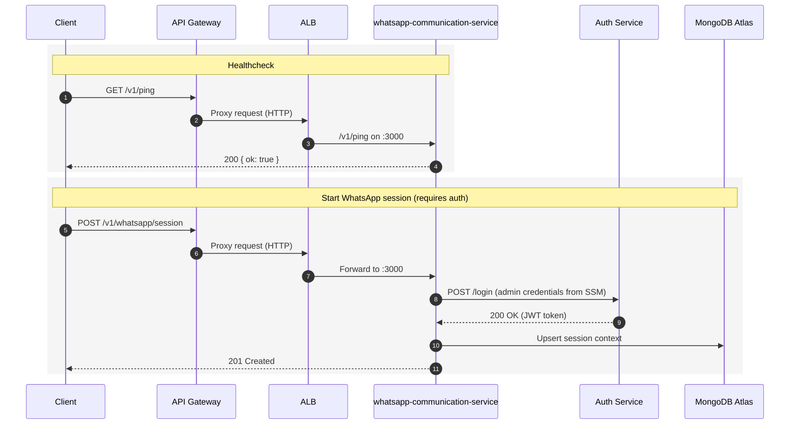

# WhatsApp Communication Service

Service for orchestrating WhatsApp conversations using Baileys, internal SmartIA microservices, and OpenAI. It runs in AWS ECS Fargate behind an Application Load Balancer (ALB) and an API Gateway that provides free HTTPS.

## Overview
- Language/Runtime: Node.js 20 (ESM)
- Container: Docker, non-root user
- Data: MongoDB Atlas; optional Redis
- External: OpenAI (optional), AWS S3 (optional)
- Production Port: `3000` (ALB forwards HTTP 80 → container 3000)
- Healthcheck: `GET /v1/ping` returns `{ "ok": true }`

## Architecture
```
Client → API Gateway (HTTPS) → ALB (HTTP) → ECS Fargate Task (container port 3000)
                                     ↘ CloudWatch Logs
                              SSM Parameter Store → Task Secrets/Env
                                      MongoDB Atlas / Redis / OpenAI
```
Key points:
- API Gateway (HTTP API) fronts the ALB to offer HTTPS without managing ACM certificates or a domain.
- The ECS task pulls config from AWS Systems Manager Parameter Store (SSM) via Task Definition secrets.
- CI/CD builds images to ECR and forces ECS deployments.

### Architecture (Mermaid)
```mermaid
graph TD
  A[Client] -- HTTPS --> B[API Gateway (HTTP API)]
  B -- HTTP --> C[Application Load Balancer]
  C -- 80 to 3000 --> D[ECS Fargate Task <br/> whatsapp-communication-service]
  D -- Read params --> E[SSM Parameter Store]
  D -- Logs --> F[CloudWatch Logs]
  D -- Mongo URI --> G[MongoDB Atlas]
  D -- Optional --> H[Redis]
  D -- Optional --> I[OpenAI API]
  D -- Optional --> J[S3 Bucket]
```

## Call Flow (Mermaid)


## Repository Layout
- `src/` Node.js sources (controllers, services, routes)
- `infra/ecs/stack.yml` ECS + ALB CloudFormation
- `infra/ecs/stack-api-gateway.yml` API Gateway CloudFormation
- `infra/params.json` / `infra/params-complete.json` Parameter values used for CloudFormation
- `infra/deploy-api-gateway.ps1` Deploy API Gateway stack
- `infra/publish-and-scale.ps1` Build/publish and scale helper (optional)
- `.github/workflows/ci_no_production.yml` Promote non-prod and prepare PR staging → main
- `.github/workflows/ci_production_new.yml` Build and deploy on push to `main`

## Configuration (SSM Parameter Store)
Sensitive configuration is read at runtime from SSM Parameter Store (as container secrets). Main parameters:
- `/smartia/production/whatsapp-communication-service/mongo-uri`
- `/smartia/production/whatsapp-communication-service/mongo-database`
- `/smartia/production/auth-service/jwt-service-url`
- `/smartia/production/auth-service/jwt-secret`
- `/smartia/production/auth-service/jwt-admin-username`
- `/smartia/production/auth-service/jwt-admin-pass`
- `/smartia/production/redis/url` (optional)
- `/smartia/production/openai/api-key` and `/smartia/production/openai/model` (optional)
- Several app service URLs under `/smartia/production/app-services/...`

Update a parameter (Windows PowerShell):
```powershell
aws ssm put-parameter `
  --name /smartia/production/auth-service/jwt-admin-pass `
  --value "<NEW_VALUE>" `
  --type SecureString `
  --overwrite `
  --region us-east-1
```
Then force a new deployment so the task reads the newest values:
```powershell
aws ecs update-service `
  --cluster whatsapp-communication-cluster `
  --service whatsapp-communication-service `
  --force-new-deployment `
  --region us-east-1
```

## Deployment
You can deploy via CloudFormation templates that live in `infra/`.

1) ECS + ALB
```powershell
aws cloudformation create-stack `
  --stack-name whatsapp-communication-ecs `
  --template-body file://infra/ecs/stack.yml `
  --parameters file://infra/params-complete.json `
  --capabilities CAPABILITY_IAM `
  --region us-east-1
aws cloudformation wait stack-create-complete `
  --stack-name whatsapp-communication-ecs `
  --region us-east-1
```
Outputs:
- `LoadBalancerDNS` → ALB DNS used by API Gateway integration

2) API Gateway (HTTPS in front of the ALB)
```powershell
# Ensure infra/params-api-gateway.json has the current ALB DNS
aws cloudformation create-stack `
  --stack-name whatsapp-communication-api-gateway `
  --template-body file://infra/ecs/stack-api-gateway.yml `
  --parameters file://infra/params-api-gateway.json `
  --region us-east-1
aws cloudformation wait stack-create-complete `
  --stack-name whatsapp-communication-api-gateway `
  --region us-east-1
```
Outputs:
- `ApiGatewayHttpsUrl` → Base HTTPS URL (e.g., `https://<api-id>.execute-api.us-east-1.amazonaws.com/prod`)

3) CI/CD (recommended)
- Push to `test` runs non-prod pipeline and prepares PR `staging → main`.
- Merge to `main` triggers `ci_production_new.yml` which builds to ECR and forces ECS deployment.

## Operations
Common operational commands (PowerShell):

- Get service status
```powershell
aws ecs describe-services `
  --cluster whatsapp-communication-cluster `
  --services whatsapp-communication-service `
  --region us-east-1 `
  --query "services[0].{Status:status,TaskDefinition:taskDefinition,Running:runningCount,Desired:desiredCount}" `
  --output table
```

- Scale service
```powershell
aws ecs update-service `
  --cluster whatsapp-communication-cluster `
  --service whatsapp-communication-service `
  --desired-count 2 `
  --region us-east-1
```

- Tail logs
```powershell
aws logs tail /ecs/whatsapp-communication-service --follow --region us-east-1
```

- Test endpoints
```powershell
# API Gateway (HTTPS) – recommended
$API = (aws cloudformation describe-stacks `
  --stack-name whatsapp-communication-api-gateway `
  --region us-east-1 `
  --query "Stacks[0].Outputs[?OutputKey=='ApiGatewayHttpsUrl'].OutputValue" `
  --output text)

curl "$API/v1/ping"
```

## Endpoints (selection)
- `GET /v1/ping` → Health check `{ ok: true }`
- `POST /v1/whatsapp/session` → Create/start a WhatsApp session
- `GET  /v1/whatsapp/session/{phone}/status`
- `GET  /v1/whatsapp/session/{phone}/qr`
- `POST /v1/caixa/webhook`

## Troubleshooting
- 500 via API Gateway after infrastructure changes
  - Cause: API Gateway still pointing to an old ALB DNS.
  - Fix: Update integration URI to the current ALB DNS:
    ```powershell
    $alb = aws elbv2 describe-load-balancers --names whatsapp-communication-alb `
      --region us-east-1 --query 'LoadBalancers[0].DNSName' --output text
    $apiId = (aws cloudformation describe-stacks `
      --stack-name whatsapp-communication-api-gateway `
      --region us-east-1 --query "Stacks[0].Outputs[?OutputKey=='ApiGatewayId'].OutputValue" --output text)
    $intId = aws apigatewayv2 get-integrations --api-id $apiId --region us-east-1 `
      --query 'Items[0].IntegrationId' --output text
    aws apigatewayv2 update-integration --api-id $apiId --integration-id $intId `
      --integration-uri "http://$alb" --region us-east-1
    ```

- 401 on auth/login from inside ECS
  - Cause: SSM credentials outdated.
  - Fix: Update `/smartia/production/auth-service/jwt-admin-*` values, then force deployment (see Configuration section).

- Task healthy but no logs
  - Ensure LogGroup `/ecs/whatsapp-communication-service` exists (created by stack) and task role has permissions.

## Local Development (optional)
Run with Node.js directly:
```powershell
npm install
npm run dev
# App listens on PORT (default 3000 in code via env), health: http://localhost:3000/v1/ping
```
Or via Docker Compose (if you have the infra compose file):
```powershell
docker compose up -d --build whatsapp-communication-service
```

## Security & Cost Notes
- API Gateway gives free HTTPS on `*.execute-api.amazonaws.com`.
- Restrict IAM for ECS task to only required SSM parameter ARNs.
- Typical monthly cost drivers: ALB, Fargate task hours, API Gateway requests, CloudWatch logs.

---
Maintainers: SmartIA Systems